# CocodPods 创建 SVN 私有库 
## 索引
* [背景](#title1)
* [准备](#title2)
* [开始](#title3)
* [后续](#title4)
* [常见问题](#title5)


## <a name=title1>一、背景</a>

随着业务需求的不断发展与变化，单工程项目的开发暴露了代码庞大、高耦合、以及内部功能复杂、运行缓慢、复用度低等缺点。面对以上情况，业界主流的重构方向是对项目进行组件化拆分，将单独功能、底层模块等以独立组件的形式拆分，再通过堆积木的方式组合起来，快速生产具备一组特定功能的应用。组件间各自独立、在最大解耦的同时，又可以相互依赖，形成一个整体。一种可行的方案就是通过 CocoaPods 来解决项目之间的依赖关系。

## <a name=title2>二、准备</a>

CocoaPods 是 iOS 开发过程中常用的解决快速集成和依赖第三方库的方式之一，CocoaPods 工作原理如图所示（图片来自网络）：

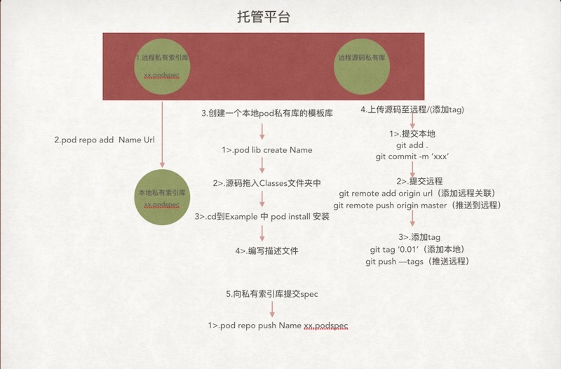

用户在终端执行 pod install 命令的时候，cocoapods 会根据本地的 Spec 仓库索引到对应的库的 podspec 文件，根据文件中的设置来配置依赖。在安装 CocoaPods 的时候，会自动在`~/.cocoapods`下创建默认的官方 master repo。按照它的工作原理，如果我们可以创建私有 Spec Repo，并且可以使 pod install 的时候根据我们私有 Repo 中的Spec 进行对依赖的安装就可以了。实际上，CocoaPods 文档上指出，我们可以根据自己的需求添加自己的私有库，但是文档上支持的是基于 git 的私有库，文档也指出是支持 SVN 的。那么接下来，来看一看正确的创建姿势吧，主要流程如下：

> 1. 安装 CocoaPods
> 2. [安装 CocoaPods 插件 cocoapods-repo-svn](#install-cocoapods-repo-svn)
> 3. [创建私有`Spec`文件 SVN 仓库](#create-spec-svn)
> 4. [创建私有库项目的 SVN 仓库](#create-framework-svn)
> 5. [本地添加 CocoaPods 私有 Repo](#create-private-repo)
> 6. [创建项目的 podsepc文件（推送到私有 Repo）](#create-podspec-file)
> 7. [编辑集成项目的 podfile 文件，pod install](#create-podfile)


[cocoapods-repo-svn-github]: https://github.com/dustywusty/cocoapods-repo-svn

***我们假设你已经安装了 CocoaPods，因此我们直接介绍从第二步之后的内容。在此，我们先从第五步开始***

## <a name="title3">三、开始</a>

### <a name="install-cocoapods-repo-svn">3.1 安装 CocoaPods 插件</a>
cocoapods-repo-svn 是 CocoaPods 的一个插件，在创建 SVN 的私有库时，此插件可以辅助项目安装过程中更加方便。具体的安装使用可以参考 [github for repo-svn][link-cocoapods-repo-svn-github]

**安装：**

```
gem install cocoapods-repo-svn 
```
安装过程 ruby 的文件夹可能没有写入权限，可以尝试使用 `sudo`权限执行安装

**repo-svn使用：**

repo-svn 是pod repo 的命令增强，具体使用可以参看 pod repo 命令

	pod repo-svn add `Repo` URL [BRANCH]	// 将远程仓库添加为本地索引 Repo。该操作会将远程的 spec 文件仓库克隆到 ~/.cocoapods/repos目录
	pod repo-svn update `Repo` // 更新指定 repo
	pod repo-svn push `Repo` [NAME.podspec] // 将指定 podsepc 文件推送到指定 repo

***repo-svn 不是 svn 私有库的必须项，但是有了插件可以使功能更加便捷，具体可以查看文章后面的内容***

### <a name="create-spec-svn">3.2 创建`Spec`的 SVN 仓库</a>

**在 SVN 上创建 podspec 文件的仓库，假设命名为`SpecRepo`（仓库下不需要 trunk、branck、tags 等目录）**

文章最开始就已经简单介绍了 Pod 的工作原理，所以只要 pod 可以正确获取到对应库的 podspec 文件，就能够根据文件内容去配置库的依赖。如果公司是以 git 作为版本控制，那么按照官网的文档，创建私有的 spec git 仓库即可满足需求。那么当版本控制使用的是 svn 的时候，也可以是同样的思路，可以创建 spec 的 git 仓库，私有库项目放在 svn 上。spec 仓库可以自己搭建，也可以使用公共的诸如 coding、码云、github 等网站创建私有仓库。但这种同时使用 svn 跟 git 的方案看起来有点奇葩，也有点不够统一。实际上，我们完全可以使用 svn 的仓库来存放 podspec 文件。

### <a name="create-framework-svn">3.3 创建私有库的 SVN 仓库</a>

创建准备作为私有库的项目，此处我们以 `LXBLog` 项目为例，该项目功能是根据预设级别打印日志，假设我们要将该功能做成一个 framework，供别的项目使用。一般情况下，我们需要对工程做一些设置，比如添加header文件、资源文件、编译文件、引用的其他库，甚至还有比如 `-ObjC`, 静态库标识等。

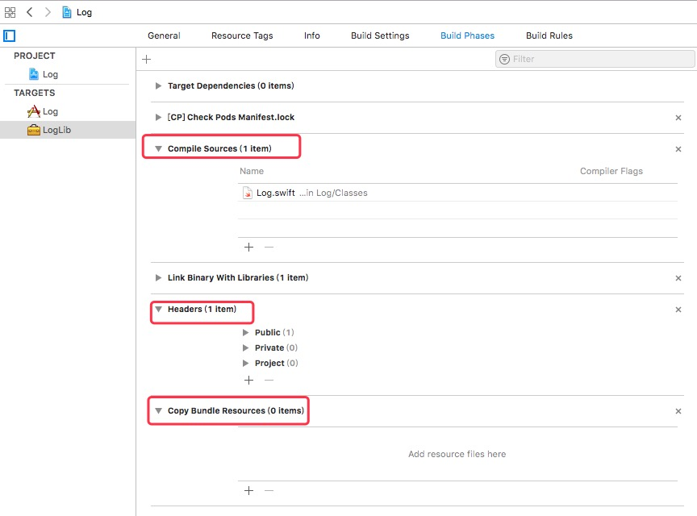

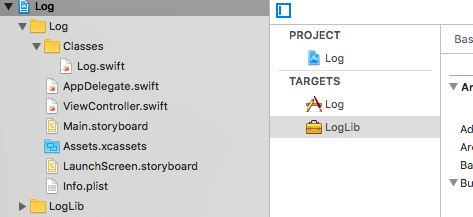

在项目目录下创建 `Classes` 目录用来存储 framework 需要编译的所有文件，创建 LXBLog.bundle 用来存放所有的资源文件。编写好代码之后，往常情况是我们编译生成对应的 framework 。现在我们用 Pod 来管理依赖，所以我们需要创建 podspec文件来告诉 Pod，我们的库的运行环境、版本、依赖、资源文件、编译文件等。由于是用作项目开发，我们可以添加 tags、trunk、branch 等目录。

***到目前为止，我们已经有两个 SVN 仓库了，一个用来存放私有 podspec 文件的 `SpecRepo`，一个用来存放我们私有库的代码 `LXBLog`***

### <a name="create-private-repo">3.4 添加 CocoaPods 私有 Repo</a>

Pod 是从本地的索引库先去找到需要的库，然后再去执行下载库与依赖安装的。因此我们要将第二步创建的 podspec 文件的 svn 仓库添加为 Pod 本地索引库，以便在执行 pod install 或者 update 的时候能找到对应的库。
首先在终端执行`pod repo`命令，默认情况下你都会一个 `master`仓库的输出，

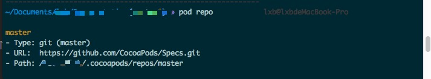

这个就是 CocoaPods 的默认索引仓库。如果需要将一个 git仓库设为索引库，只需要执行:

```
pod repo add NAME URL [BRANCH]
```

命令即可，其中 NAME 是本地的仓库名称，url 是 git 地址。**但是**，如果是一个 svn 仓库地址，如`svn://192.168.0.88/ios/SpecRepo`的地址，你会发现执行时会报错，此时就需要用我们的插件了。假设我们将本地仓库命名为 `TJSpecRepo `,那么命令应该这么写：

```
pod repo-svn add TJSpecRepo svn://192.168.0.88/ios/SpecRepo
```
再执行 `pod repo`，输出如下，除了 master 多了一个 TJSpecRepo。


### <a name="create-podspec-file">3.5 编写podsepc文件</a>

以上工作完成之后，要编写 podspec 文件，好让 Pod 知道我们的库在被人使用时，需要遵守的规则、编译的代码文件、资源文件、引入的系统库、依赖的第三方等等。我们把 [3.3](#create-framework-svn) 创建的项目克隆到本地，一般情况，我们会把每个项目的 podspec 文件放在项目中，有修改时再推送到私有索引库中，我们在 LXBLog项目下，执行命令：

```
pod spec create LXBLog
```

之后，在项目目录下可以看到多出了一个 `LXBLog.podspec` 的文件。

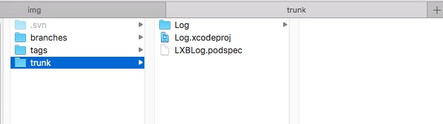

打开该文件，里面的内容就是 podspec 文件的默认内容，注释部分对每一项也有详细的解释，另外我们还可以参看官网的 [Podspec Syntax Reference][link-Podspec-Syntax-Reference]，官方文档对没所有的设置项都做了介绍。

	---
	# 名字，用来使用或者搜索时的名字
	s.name         = "LXBLog" 	
	
	# 版本号
	s.version      = "0.0.1"	
	
	# 简介
	s.summary      = "A short description of LXBLog."  
	
	# 详情描述，用来详细描述库的用途
	s.description  = <<-DESC
	                 DESC
	
	# 主页，可以是官网，github 地址等可用地址，否则会报错
	s.homepage     = "http://EXAMPLE/LXBLog" 
	
	# 授权 license，私有库往往是在局域网使用，只要存在 license 即可，如果是要开源的库，那么要注意你自己选择的授权。
	s.license      = "MIT (example)"	
	
	# 邮箱
	s.author       = { "author name" => "author_email@163.com" }
	
	# source 对应的私有库地址，及用来检索库的地址，官网上对此项有比较多的例子来介绍
	s.source       = { :git => "http://EXAMPLE/LXBLog.git", :tag => "#{s.version}" }
	
	# 项目所包含的代码源文件，可以是 swift、h、m、mm、c、cpp 等格式的文件
	s.source_files  = "Classes", "Classes/**/*.{h,m}"
	
	# 资源文件
	s.resources 	  = ['Source/readme', Source/XXXX.bundle]
	
	# 项目的其他 CocoaPods 库的依赖
	s.dependency "JSONKit", "~> 1.4"	
	---

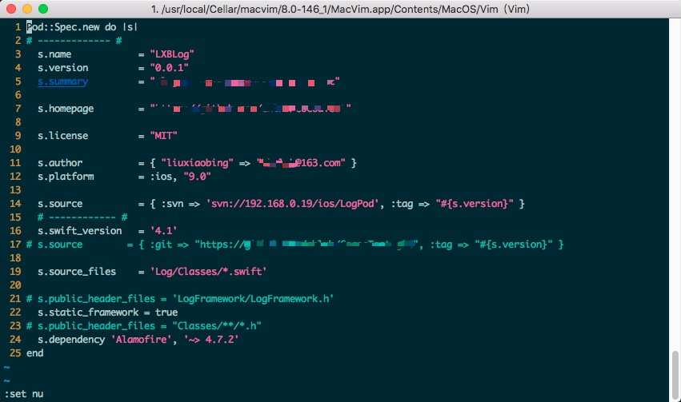

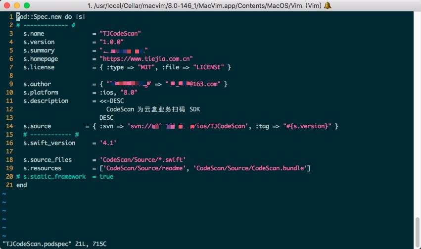

podspec 文件编辑好之后，可以通过终端命令`pod lib lint`来验证语法以及格式是否正确，关于该命令的使用可以参看 [Command-line-Reference][link-Command-line-Reference]。终端会给出错误的原因以及错误所在，按照提示进行修改直到可以通过验证。license文件要存放在指定的路径下，例如上图中 `s.license = { :type => "MIT", :file => "LICENSE" }` 那么在项目目录下，需要存在对应的名为 `LICENSE` 的文件。由于我的例子使用 swift 编写，swift_version 在低版本的 Pod 上面是不支持的，因此某些错误情况可能需要先对 CocoaPods 进行升级，编辑该文档时，我的 CocoaPods 版本是 `1.5.3`

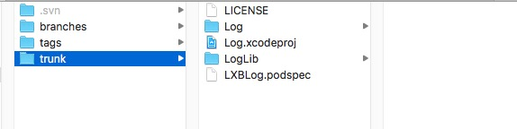

之后我们把便捷好的 podspec 文件推送到我们本地的私有 SpecRepo 中，**执行命令:**

```
pod repo-svn push TJSpecRepo LXBLog.podspec
```
我们再看远程的 SpecRepo，此时也出现了提交记录，打开之后发现，LXBLog.podspec 也被推送到的远程仓库，可见在执行上面命令的时候，同时也会对我们的修改提交到远端的 svn 仓库，git 也是如此。以上工作完成之后，也可以像搜索别的第三方库一样使用 pod search 命令来搜索我们自己的库。
**执行命令:**
```
pod search LXBLog
```
***注意：如果以上搜索没有结果，需要将`~/Library/Caches/CocoaPods/`路径下的`search_index.json`文件删除，然后执行命令即可***

### <a name="create-podfile">3.6 Podfile</a>

万事俱备！现在可以使用我们的私有库了，创建 `PodTest` 项目,在项目目录下**执行命令：**
`pod init`会在 PodTest 中生成了默认的 Podfile 文件。假设我们的项目还要只用 Alamofire 网络库，因此将内容按照下图修改，然后**执行命令**`pod install`，看看发生了什么。

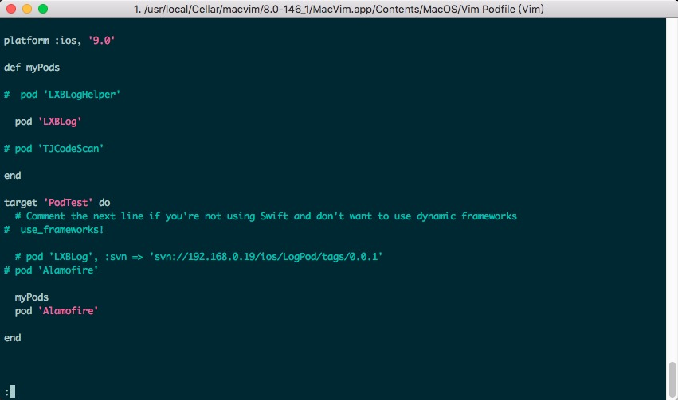

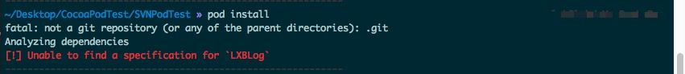

什么？pod search 都能找到我们的私有库，为什么 install 的时候 Unable to find ？这是因为默认情况下 Pod 都是从 CocoaPods 的官方仓库源去查找索引的，我们的私有库是放在我们自己的 svn 索引仓库里，此时当然无法在官方源找到。继续对 Podfile 做如下修改，添加红色标记的内容，然后再执行 `pod install`命令：

	source 'https://github.com/CocoaPods/Specs.git'
	plugin 'cocoapods-repo-svn', :sources => [
           'svn://192.168.0.19/ios/TJSpecRepo'
      ]

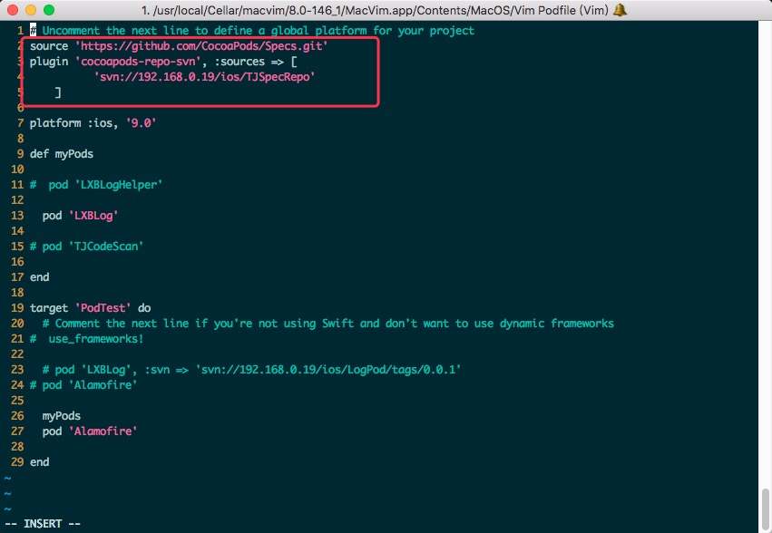

不出意外，会得到大概类似如下图中的输出，打开项目，就可以正常引入我们的 `LXBLog` 以及 `Alamofire` 库，并正常使用。

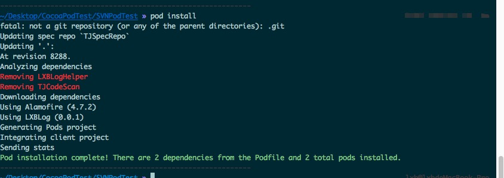

***如果是 git 创建的私有仓库，那么添加形如 `source 'https://github.com/CocoaPods/Specs.git'` 的仓库地址就可以了，不需要添加`plugin 'cocoapods-repo-svn' ...`***

## <a name=title4>四、后续</a>

进行到上一步看起来我们的私有库已经可以正常工作了，但其实还不算完。以上过程相当于整合所有网上资料后的结果，但是在此过程中遇到的一些问题，也是有必要了解的。

* 可以使用私有的 git 仓库来存放 podspec 文件 
	
	[3.2 创建 Spec 仓库](#create-spec-svn) 部分就提到过，我们其实可以创建 git 仓库作为私有 podspec 的存放，这样的话就不会涉及之后创建 SVN 作为索引仓库的步骤，也不需要安装 repo-svn 插件，另外 Podfile 文件只需要在 source 中也指定我们的 git 地址即可。

* 可以不创建私有 SpecRepo 仓库
	
	参考上一问题提到的使用 git 代替 svn 的话，这一步就不需要了，另外如果我们把 podspec 文件随私有库项目一起提交到项目 svn 仓库，此时只要在 Podfile 中直接以 `pod 'LXBLog', :svn => 'svn://192.168.0.19/ios/LogPod/tags/0.0.1'` 添加私有库，也是可以正常引入并安装的。
	查看[官网文档][link-Podfile-Syntax-Reference]会发现，Podfile引入第三方库的方式有很多
	
		pod 'PonyDebugger', :source => 'https://github.com/CocoaPods/Specs.git'
		pod 'QueryKit', :subspecs => ['Attribute', 'QuerySet']
		pod 'AFNetworking', :path => '~/Documents/AFNetworking'
		pod 'AFNetworking', :git => 'https://github.com/gowalla/AFNetworking.git'
		pod 'JSONKit', :podspec => 'https://example.com/JSONKit.podspec'
		pod 'LXBLog', :svn => 'svn://192.168.0.19/ios/LogPod/tags/0.0.1'
	
* 可以不将 podspec 推送到远程服务器

	结合上一步 pod 一个库的方式可以发现，实际上也是支持本地路径的，总之只要能正确找到对应库的 podspec 文件，就可以根据该文件正确加载库。

* 可以不安装 repo-svn 插件

	综上，repo-svn 库也可以不安装

* 私有库怎么依赖别的私有库

	在组件化的过程中，可能会有上层组件 A 依赖更下层组件 B，然后 app 项目有同时依赖 A 和 B，或者只依赖 A 的情况出现。此时 app 项目的 Podfile 正常引入 A、B 即可，但是 A 项目的 podspec 该怎么处理呢。之前我们在创建 podspec文件的时候介绍了 `s.dependency`，该选项就是指定了项目依赖的。比如我们有`LXBLogHelper`项目，同时依赖`LXBLog`跟`Alamofire`两个库。如图：

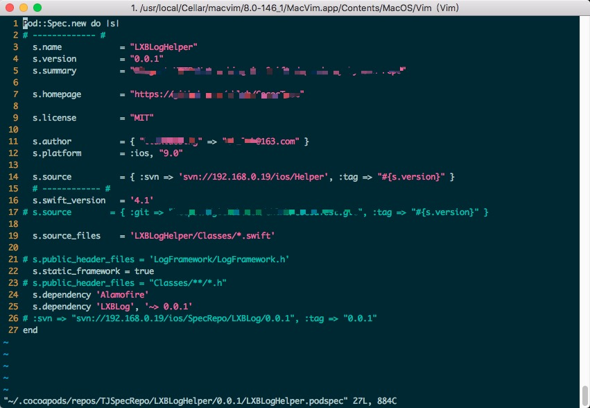

编辑好该项目的 podspec 文件，执行`pod lib lint`的时候你会发现 `Unable find LXBLog`的报错

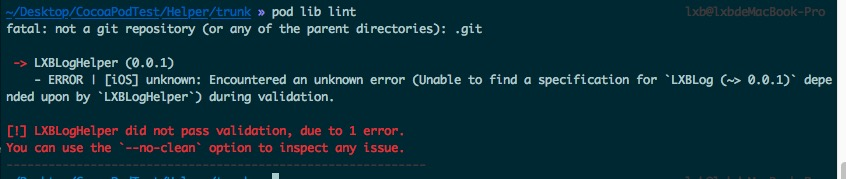

**思路一：**

查过文档后发现解决方法跟 Podfile 找不到的时候指定 source 的解决思路相似，只不过这次是在验证 podspec格式的时候添加 sources选项，用到的所有 source 都需要添加，中间用逗号分隔:

	# 方法一：
	pod lib lint LXBLogHelper.podspec  --sources=svn://192.168.0.19/ios/SpecRepo,repo2,repo3
	# 方法二：TJSpecRepo, master是本地的索引库名称，即 `~/.cocoapods/repos/` 下面文件夹的名称
	pod lib lint LXBLogHelper.podspec  --sources=TJSpecRepo,master
	
如果你使用 git 仓库那么这么做应该没什么问题(此处没做验证)，但是当你使用 svn 的时候，又会得到如下错误

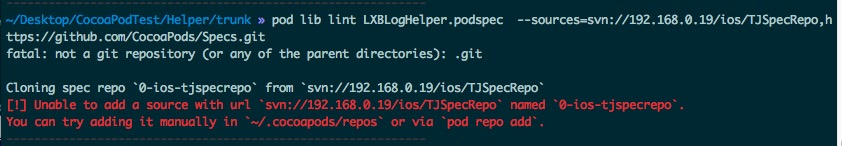

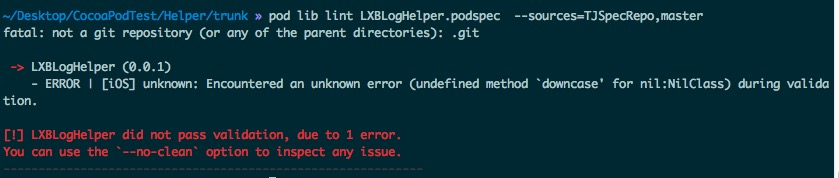

在 [repo-svn的 issues][link-repo-svn-issues] 有提到，但是这种方式实际上还是会报错。其实这个 issues 已经给出了答案，只不过没有说清楚，经过测试发现虽然 pod lib lint 执行会报错，但是只要配置没有问题，此时直接在 pod repo-svn push 以及 Podfile 中引入 LXBLogHelper 库都可以正常工作。结论就是如果是 svn 的仓库的话，pod lib lint 这一步可以先注释私有库，看看别的配置是否正确，最后再把依赖的私有库加进来，然后直接 push 该 podspec 文件并使用即可。

**思路二：**
当时也考虑使用 subspec 的方式来避免这个问题，就是我们只创建一个大的私有项目库，然后讲该项目按功能分成多个 subspec，subspec 的使用可以参考官方文档，做过 RN 开发的同学也可以参看 RN 里面 posspec 的配置。RN 将核心库分成了多个 subspec进行配置，subspec之间可以相互依赖。使用的时候只需要引入需要使用的 subspec 即可。

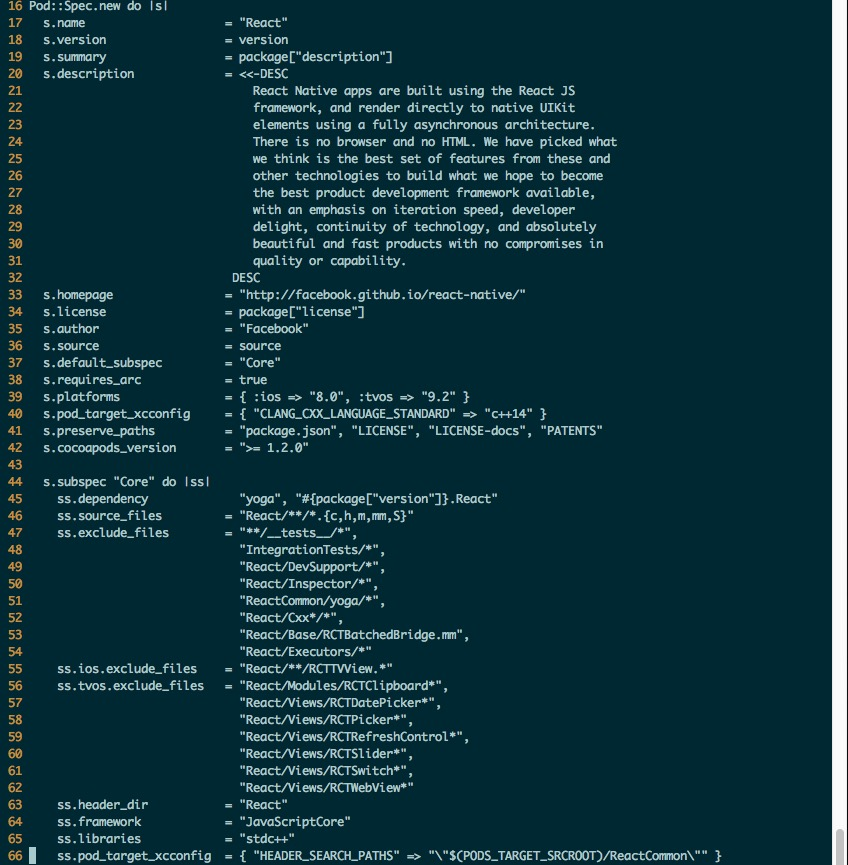

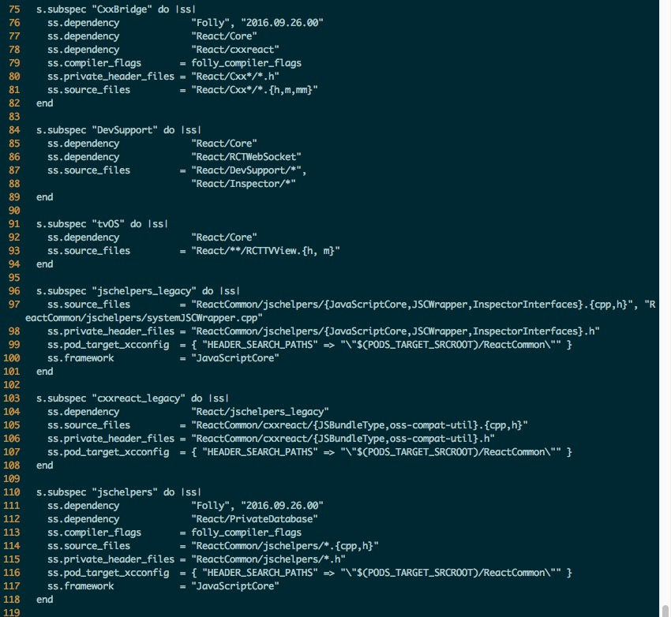

使用时 Podfile 中配置如图：

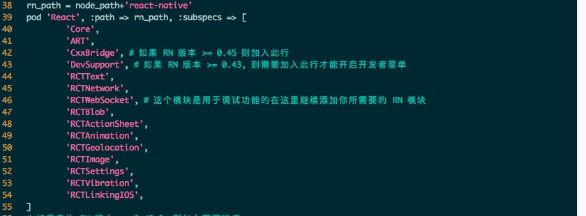

***subspec 的方式目前还没有验证，接下来的工作中应该会遇到这个问题，到时候如果还有别的问题被引出，再做补充***

到此，CocoaPods 创建基于 SVN 的私有库基本已经可以正常使用了，更进一步可能会遇到的问题比如 swift 应用 OC，或者 OC 引用 swift 库需要在实际工作中进行分析。由于时间问题，文章中部分问题没有进行验证，只是在网络资料的基础上做了假设，可能存在偏颇，使用过程中如果遇到不相符的情况，希望可以得到提醒与纠正，在此谢过

## <a name=title5>五、常见问题</a>

-

[link-cocoapods-repo-svn-github]: https://github.com/dustywusty/cocoapods-repo-svn
[link-Podspec-Syntax-Reference]: https://guides.cocoapods.org/syntax/podspec.html
[link-Podfile-Syntax-Reference]: https://guides.cocoapods.org/syntax/podfile.html
[link-Command-line-Reference]: https://guides.cocoapods.org/terminal/commands.html
[link-repo-svn-issues]: https://github.com/dustywusty/cocoapods-repo-svn/issues/13

***参考文档***

* [1] <https://guides.cocoapods.org/syntax/podspec.html> Podspec Syntax Reference
* [2] <https://guides.cocoapods.org/syntax/podfile.html> Podfile Syntax Reference
* [3] <https://guides.cocoapods.org/terminal/commands.html> Command-line Reference
* [4] <https://guides.cocoapods.org/making/private-cocoapods.html> Private Pods
* [5] <https://github.com/CocoaPods/CocoaPods/> CocoaPods’s GitHub
* [6] <https://github.com/dustywusty/cocoapods-repo-svn> cocoapods-repo-svn's GitHub

--

### THE END